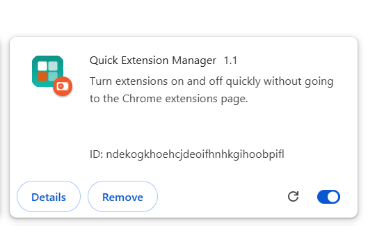
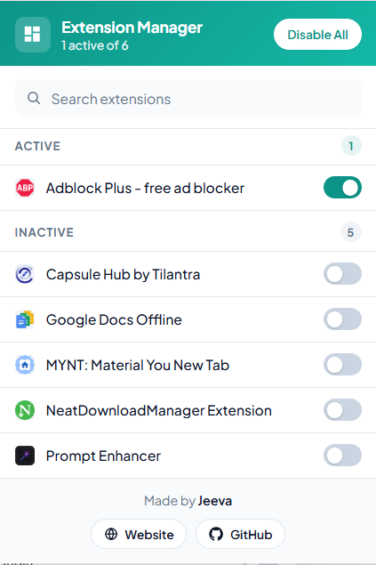

# Quick Extension Manager

[](https://github.com/JeevaVenkidu/quick-extension-manager/actions/workflows/ci.yml)
[](LICENSE)
[](https://developer.chrome.com/docs/extensions/develop/migrate/what-is-mv3)

Search, enable, disable, and organize installed Chrome extensions from the browser toolbar. Quick Extension Manager is a small, privacy-conscious utility for developers, power users, and browser enthusiasts who do not want to open Chrome's full extension management page for routine actions.

## Screenshots

### Installed Extension

Quick Extension Manager loaded from `chrome://extensions/` in Chrome:



### Extension Popup

The toolbar popup with extension search, active and inactive groups, and individual toggles:



The screenshots are stored in [`Screenshots/`](Screenshots/) and match the checked-in implementation in [popup.html](popup.html), [popup.css](popup.css), and [popup.js](popup.js).

## Features

- Search installed extensions by name as you type.
- Toggle individual extensions on or off.
- Enable or disable all currently applicable extensions with confirmation.
- Group results into Active and Inactive sections.
- Show extension icons with a safe fallback when an icon is unavailable.
- Provide keyboard-focus states, labels, empty states, and reduced-motion support.
- Run entirely in the extension popup with no backend, account, or analytics service.

## Installation

### Chrome Web Store

A Chrome Web Store listing is not currently maintained. Use the manual installation steps below to load the open-source build directly in Chrome.

### Manual Installation

1. Download `quick-extension-manager.zip` from the latest [GitHub Release](https://github.com/JeevaVenkidu/quick-extension-manager/releases).
2. Extract the archive to a permanent folder.
3. Open `chrome://extensions` in Chrome.
4. Enable **Developer mode**.
5. Select **Load unpacked** and choose the extracted folder containing `manifest.json`.
6. Pin **Quick Extension Manager** from Chrome's Extensions menu for toolbar access.

Only install release archives from this repository or builds you created from a reviewed checkout.

## Development Setup

The project has no npm dependencies or compilation step. You need:

- Google Chrome or a Chromium-based browser with Manifest V3 support.
- Git, if working from a clone.
- Node.js 20 or newer for the optional local validation commands.

Clone the repository and load it as an unpacked extension:

```bash
git clone https://github.com/JeevaVenkidu/quick-extension-manager.git
cd quick-extension-manager
```

Then follow the [manual installation](#manual-installation) steps and choose the repository directory. After changing `popup.html`, `popup.css`, `popup.js`, or `manifest.json`, return to `chrome://extensions` and press **Reload**.

## Folder Structure

```text
quick-extension-manager/
├── .github/                 # Issue templates, PR template, and Actions workflows
├── icon16.png               # Toolbar and small-list icon
├── icon48.png               # Extension management page icon
├── icon128.png              # Store and large-list icon
├── manifest.json             # Manifest V3 metadata and permissions
├── popup.html                # Popup structure and accessible labels
├── popup.css                 # Popup layout, theme, and responsive states
├── popup.js                  # Extension discovery, filtering, and toggles
├── ARCHITECTURE.md           # Runtime and permission design
├── CONTRIBUTING.md           # Contribution workflow
├── LICENSE                   # MIT license
├── SECURITY.md               # Vulnerability reporting policy
└── ...                       # Project policies and planning documents
```

## Architecture Overview

Quick Extension Manager is a self-contained browser action popup. On load, `popup.js` calls the Chrome Management API, removes the manager itself from the result, sorts extensions by name, and renders the current state. User actions call `chrome.management.setEnabled()` and update the in-memory list after Chrome confirms the change.

The only privileged permission is `management`, required to enumerate installed extensions and change their enabled state. There is no service worker, content script, remote API, persistent database, or build output. See [ARCHITECTURE.md](ARCHITECTURE.md) for the full data flow and security boundaries.

## Build Instructions

There is no source compilation or bundling. A production archive is a ZIP containing the runtime files listed below:

```text
manifest.json
popup.html
popup.css
popup.js
icon16.png
icon48.png
icon128.png
```

To create the same archive locally in PowerShell:

```powershell
Compress-Archive -Path manifest.json,popup.html,popup.css,popup.js,icon16.png,icon48.png,icon128.png -DestinationPath quick-extension-manager.zip -Force
```

The archive must contain `manifest.json` at its root, not inside an extra directory.

## Release Process

1. Update `manifest.json` and `CHANGELOG.md` with the release version.
2. Run the validation commands described in [CONTRIBUTING.md](CONTRIBUTING.md).
3. Merge the release change to `main`.
4. Create and push an annotated tag such as `v1.0.0`.
5. GitHub Actions validates the tag, builds `quick-extension-manager.zip`, and attaches it to the GitHub Release.

See [ROADMAP.md](ROADMAP.md) for planned product work and [CHANGELOG.md](CHANGELOG.md) for released changes.

## Roadmap

The maintained roadmap is in [ROADMAP.md](ROADMAP.md). It intentionally favors small, local improvements over a larger permissions footprint or a framework migration.

## FAQ

Common questions and troubleshooting steps are collected in [FAQ.md](FAQ.md).

## Contributing

Bug reports, documentation fixes, accessibility improvements, and focused feature proposals are welcome. Read [CONTRIBUTING.md](CONTRIBUTING.md) before opening an issue or pull request and follow the [Code of Conduct](CODE_OF_CONDUCT.md).

## Security

Quick Extension Manager requires the Chrome `management` permission because it manages installed extensions. It does not send extension data anywhere. Report suspected vulnerabilities privately using the process in [SECURITY.md](SECURITY.md), rather than opening a public issue.

## License

Quick Extension Manager is released under the [MIT License](LICENSE).

## Author

Created and maintained by [JeevaVenkidu](https://github.com/JeevaVenkidu).

## Support Links

- [Report a bug](https://github.com/JeevaVenkidu/quick-extension-manager/issues/new?template=bug_report.yml)
- [Request a feature](https://github.com/JeevaVenkidu/quick-extension-manager/issues/new?template=feature_request.yml)
- [Ask a question](https://github.com/JeevaVenkidu/quick-extension-manager/issues/new?template=question.yml)
- [Browse discussions](https://github.com/JeevaVenkidu/quick-extension-manager/discussions)
- [View releases](https://github.com/JeevaVenkidu/quick-extension-manager/releases)
